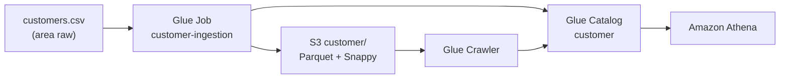

# Data Mesh AWS - E-commerce Olist

Plataforma de dados orientada a dominios (Data Mesh) utilizando AWS e Terraform.

## Sprints

| Sprint | Descricao | Status |
|--------|-----------|--------|
| DM-001 | Infraestrutura base do dominio Clientes | Concluida |
| DM-002 | Ingestao do dataset customers.csv | Concluida |

## Arquitetura DM-002



## Estrutura do Projeto

```
terraform/
  modules/
    s3/              # Bucket do dominio
    glue/            # Glue Database (DM-001)
    glue_database/   # Glue Database (modulo canonico DM-002)
    glue_crawler/    # Glue Crawler
    glue_job/        # Glue Job + upload de script
    iam/             # Roles admin, consumer, ETL, crawler
    lakeformation/   # Governanca federada
  environments/dev/  # Stack do ambiente dev

data-products/customer/
  scripts/customer_ingestion.py

data/raw/customers.csv

tests/
  Run-DM001Tests.ps1 / Validate-DM001Aws.ps1
  Run-DM002Tests.ps1 / Validate-DM002Aws.ps1
```

## Pre-requisitos

- Terraform >= 1.6
- AWS CLI configurado
- PowerShell 5.1+

## Deploy DM-002

```powershell
# 1. (Opcional) Baixar dataset completo Olist
powershell -File scripts/Download-OlistCustomers.ps1

# 2. Provisionar infraestrutura
cd terraform/environments/dev
terraform init
terraform apply

# 3. Executar ingestao manualmente
aws glue start-job-run --job-name clientes-domain-dev-customer-ingestion
aws glue start-crawler --name clientes-domain-dev-customer-crawler

# Ou habilitar execucao automatica no apply:
# run_customer_ingestion_on_apply = true  (terraform.tfvars)
```

## Testes

```powershell
# DM-001
powershell -File tests/Run-DM001Tests.ps1

# DM-002 (com ingestao e validacao Athena)
powershell -File tests/Run-DM002Tests.ps1 -RunIngestion
```

## Resultado Esperado

| Item | Valor |
|------|-------|
| Tabela | `customer` |
| Database | `clientes_domain` |
| Localizacao | `s3://{bucket}/customer/` |
| Formato | Parquet (Snappy) |
| Particao | `customer_state` |

## Tags Obrigatorias

Todos os recursos recebem:

- `project = data-mesh-ecommerce`
- `domain = clientes`
- `managed_by = terraform`
- `environment = dev`

## Documentacao

- [ADR DM-002](docs/architecture/decisions/ADR-DM002-customer-ingestion.md)
