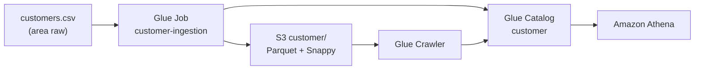
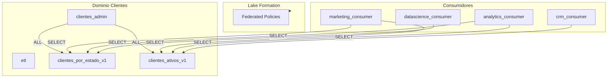
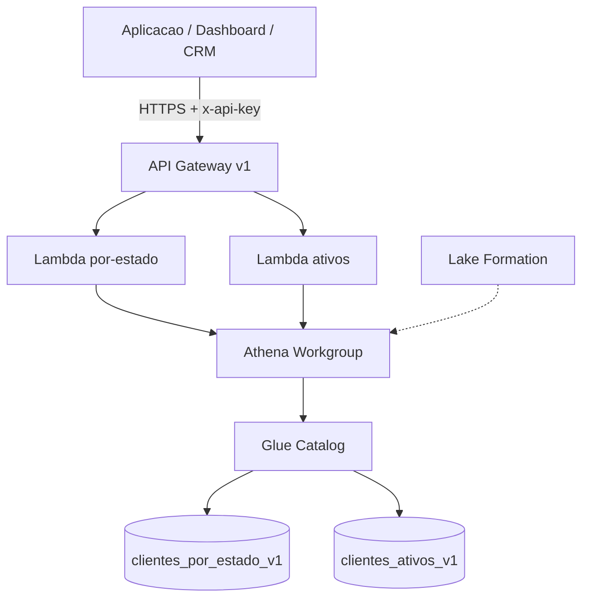

# Data Mesh AWS - E-commerce Olist

Plataforma de dados orientada a dominios (Data Mesh) utilizando AWS e Terraform.

## Sprints

| Sprint | Descricao | Status |
|--------|-----------|--------|
| DM-001 | Infraestrutura base do dominio Clientes | Concluida |
| DM-002 | Ingestao do dataset customers.csv | Concluida |
| DM-003 | Publicacao clientes_por_estado_v1 | Concluida |
| DM-004 | Publicacao clientes_ativos_v1 | Concluida |
| DM-005 | Governanca federada Lake Formation | Concluida |
| DM-006 | Exposicao de Data Products via API | Concluida |

## Arquitetura DM-002



## Estrutura do Projeto

```
terraform/
  modules/
    s3/              # Bucket do dominio
    glue/            # Glue Database (DM-001)
    glue_database/   # Glue Database (modulo canonico DM-002)
    glue_crawler/    # Glue Crawler
    glue_job/        # Glue Job + upload de script
    iam/             # Roles admin, consumer, ETL, crawler
    lakeformation/   # Governanca federada
  environments/dev/  # Stack do ambiente dev

data-products/customer/
  scripts/customer_ingestion.py

data/raw/customers.csv

tests/
  Run-DM001Tests.ps1 / Validate-DM001Aws.ps1
  Run-DM002Tests.ps1 / Validate-DM002Aws.ps1
```

## Pre-requisitos

- Terraform >= 1.6
- AWS CLI configurado
- PowerShell 5.1+

## Deploy DM-003

```powershell
cd terraform/environments/dev
terraform apply

# Publicar Data Product (apos customer ingerido)
aws glue start-job-run --job-name clientes-domain-dev-clientes-por-estado-v1-publish

# Testes (a partir deste diretorio)
powershell -File run-dm003-tests.ps1 -RunPublish
```

## Data Product clientes_por_estado_v1

| Item | Valor |
|------|-------|
| Tabela | `clientes_por_estado_v1` |
| Schema | customer_state, total_clientes, data_referencia |
| S3 | `data-products/clientes_por_estado_v1/` |
| SLA | Diario 06:00 UTC |

- [ADR DM-003](docs/architecture/decisions/ADR-DM003-clientes-por-estado-v1.md)
- [Documentacao](docs/data-products/clientes_por_estado_v1.md)

## Deploy DM-004

```powershell
cd terraform/environments/dev
terraform apply

# Ingerir orders (fonte Pedidos) e publicar Data Product
aws glue start-job-run --job-name clientes-domain-dev-orders-ingestion
aws glue start-job-run --job-name clientes-domain-dev-clientes-ativos-v1-publish

# Testes (a partir deste diretorio)
powershell -File run-dm004-tests.ps1 -RunPublish
```

## Data Product clientes_ativos_v1

| Item | Valor |
|------|-------|
| Tabela | `clientes_ativos_v1` |
| Regra | Compra nos ultimos 90 dias (`dias_atividade`) |
| Fontes | `customer` + `pedidos_domain.orders` |
| Particao | `customer_state` |
| SLA | Diario 06:00 UTC |

- [ADR DM-004](docs/architecture/decisions/ADR-DM004-clientes-ativos-v1.md)
- [Documentacao](docs/data-products/clientes_ativos_v1.md)

## Consultas Athena (Insights)

No console Athena, use:

| Configuracao | Valor |
|--------------|-------|
| Workgroup | `clientes-domain-dev` |
| Database | `clientes_domain` |

Consumidores (Marketing, CRM, Analytics) devem consultar **apenas** os Data Products publicados abaixo — sem acesso direto a `customer`, `orders` ou `order_items`.

Named queries salvas no Terraform: `clientes_por_estado_v1-preview` e `clientes_ativos_v1-preview`.

### clientes_por_estado_v1

Distribuicao de clientes cadastrados por estado:

```sql
SELECT *
FROM clientes_domain.clientes_por_estado_v1
ORDER BY total_clientes DESC;
```

Total nacional de clientes:

```sql
SELECT SUM(total_clientes) AS total_geral
FROM clientes_domain.clientes_por_estado_v1;
```

Estados com maior concentracao (top 5):

```sql
SELECT customer_state, total_clientes
FROM clientes_domain.clientes_por_estado_v1
ORDER BY total_clientes DESC
LIMIT 5;
```

### clientes_ativos_v1

Visao geral dos clientes ativos (compra nos ultimos 90 dias):

```sql
SELECT *
FROM clientes_domain.clientes_ativos_v1
ORDER BY dias_desde_ultima_compra ASC
LIMIT 100;
```

Quantos clientes ativos existem hoje:

```sql
SELECT COUNT(*) AS total_clientes_ativos
FROM clientes_domain.clientes_ativos_v1;
```

Clientes ativos por estado:

```sql
SELECT
    customer_state,
    COUNT(*) AS total_ativos
FROM clientes_domain.clientes_ativos_v1
GROUP BY customer_state
ORDER BY total_ativos DESC;
```

Base elegivel para campanhas em um estado (ex.: SP):

```sql
SELECT
    customer_id,
    customer_unique_id,
    customer_state,
    ultima_compra,
    dias_desde_ultima_compra
FROM clientes_domain.clientes_ativos_v1
WHERE customer_state = 'SP'
ORDER BY ultima_compra DESC;
```

Clientes para retencao (compra recente, ultimos 30 dias):

```sql
SELECT
    customer_id,
    customer_unique_id,
    customer_state,
    ultima_compra,
    dias_desde_ultima_compra
FROM clientes_domain.clientes_ativos_v1
WHERE dias_desde_ultima_compra <= 30
ORDER BY ultima_compra DESC;
```

Snapshot diario do produto:

```sql
SELECT
    data_referencia,
    COUNT(*) AS total_ativos
FROM clientes_domain.clientes_ativos_v1
GROUP BY data_referencia;
```

Validar governanca da regra dos 90 dias (deve retornar 0):

```sql
SELECT COUNT(*) AS fora_da_janela
FROM clientes_domain.clientes_ativos_v1
WHERE dias_desde_ultima_compra > 90;
```

## DM-005 - Governanca Federada



| Role | Acesso |
|------|--------|
| `clientes-domain-dev-admin` | ALL (owner) |
| `clientes-domain-dev-marketing-consumer` | SELECT em ambos produtos |
| `clientes-domain-dev-analytics-consumer` | SELECT em ambos produtos |
| `clientes-domain-dev-datascience-consumer` | SELECT apenas `clientes_por_estado_v1` |
| `clientes-domain-dev-crm-consumer` | SELECT apenas `clientes_ativos_v1` |

```powershell
cd terraform/environments/dev
terraform apply
powershell -File run-dm005-tests.ps1
```

- [ADR DM-005](docs/architecture/decisions/ADR-DM005-federated-governance.md)
- [Simulacao por ator (Data Mesh)](docs/guides/simulacao-atores-data-mesh.md)

## DM-006 - API de Data Products

Camada REST para consumo dos Data Products sem SQL ou acesso direto ao data lake.



### Endpoints

| Metodo | Path | Descricao |
|--------|------|-----------|
| GET | `/clientes/por-estado` | Distribuicao de clientes por UF |
| GET | `/clientes/ativos` | Clientes com compra nos ultimos 90 dias |
| GET | `/clientes/ativos?estado=SP` | Filtro por estado (UF valida) |

### Deploy e testes

**Permissoes IAM do usuario de deploy:** alem das permissoes ja usadas em DM-001 a DM-005, o DM-006 exige `apigateway:POST`, `apigateway:GET`, `apigateway:PATCH`, `apigateway:PUT`, `lambda:*` (criacao) e opcionalmente `logs:CreateLogGroup` se `create_log_group = true` nas Lambdas.

```powershell
cd terraform/environments/dev
terraform apply
powershell -File run-dm006-tests.ps1
```

Exemplo de consumo:

```powershell
$apiKey = terraform output -raw data_products_api_key
$url = terraform output -raw data_products_api_por_estado_url
Invoke-RestMethod -Uri $url -Headers @{ "x-api-key" = $apiKey }
```

Documentacao:

- [OpenAPI v1](docs/openapi/data-products-api-v1.yaml)
- [ADR DM-006](docs/architecture/decisions/ADR-DM006-api-exposure.md)
- [Simulacao por ator (Data Mesh)](docs/guides/simulacao-atores-data-mesh.md)

## Deploy DM-002

```powershell
# 1. (Opcional) Baixar dataset completo Olist
powershell -File scripts/Download-OlistCustomers.ps1

# 2. Provisionar infraestrutura
cd terraform/environments/dev
terraform init
terraform apply

# 3. Executar ingestao manualmente
aws glue start-job-run --job-name clientes-domain-dev-customer-ingestion
aws glue start-crawler --name clientes-domain-dev-customer-crawler

# Ou habilitar execucao automatica no apply:
# run_customer_ingestion_on_apply = true  (terraform.tfvars)
```

## Testes

A partir da raiz do repositorio:

```powershell
# DM-001
powershell -File tests/Run-DM001Tests.ps1

# DM-002 (com ingestao e validacao Athena)
powershell -File tests/Run-DM002Tests.ps1 -RunIngestion

# DM-003 (publicacao clientes_por_estado_v1)
powershell -File tests/Run-DM003Tests.ps1 -RunPublish

# DM-004 (publicacao clientes_ativos_v1)
powershell -File tests/Run-DM004Tests.ps1 -RunPublish

# DM-005 (governanca federada Lake Formation)
powershell -File tests/Run-DM005Tests.ps1

# DM-006 (API REST Data Products)
powershell -File tests/Run-DM006Tests.ps1
```

A partir de `terraform/environments/dev`:

```powershell
powershell -File run-dm003-tests.ps1 -RunPublish
powershell -File run-dm004-tests.ps1 -RunPublish
powershell -File run-dm005-tests.ps1
powershell -File run-dm006-tests.ps1
```

## Resultado Esperado

| Item | Valor |
|------|-------|
| Tabela | `customer` |
| Database | `clientes_domain` |
| Localizacao | `s3://{bucket}/customer/` |
| Formato | Parquet (Snappy) |
| Particao | `customer_state` |

## Tags Obrigatorias

Todos os recursos recebem:

- `project = data-mesh-ecommerce`
- `domain = clientes`
- `managed_by = terraform`
- `environment = dev`

## Documentacao

- [Simulacao do processo real por ator](docs/guides/simulacao-atores-data-mesh.md)
- [ADR DM-002](docs/architecture/decisions/ADR-DM002-customer-ingestion.md)
