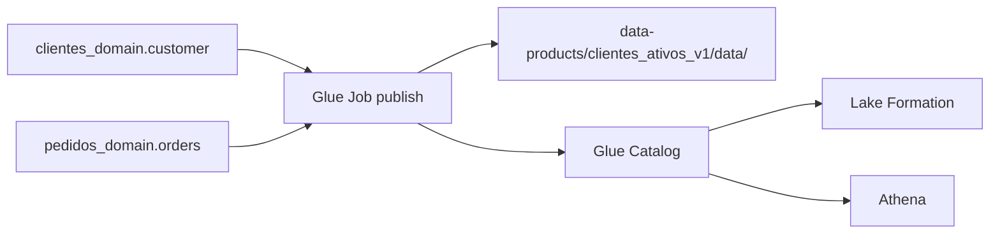

# Data Product: clientes_ativos_v1

Behavioral Data Product com clientes que compraram nos ultimos 90 dias.

## Contrato

| Campo | Tipo |
|-------|------|
| customer_id | string |
| customer_unique_id | string |
| customer_state | string |
| ultima_compra | timestamp |
| dias_desde_ultima_compra | int |
| ativo | boolean |
| data_referencia | date |

Particionamento: `customer_state`
