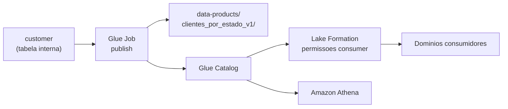

# Data Product: clientes_por_estado_v1

Documentacao federada do primeiro Data Product publicado pelo dominio Clientes.

## Contrato

| Campo | Tipo | Descricao |
|-------|------|-----------|
| customer_state | string | UF do cliente |
| total_clientes | bigint | Total de clientes no estado |
| data_referencia | date | Data da agregacao |

## Localizacao

```
s3://{bucket}/data-products/clientes_por_estado_v1/
```

## Catalogo

- **Database:** `clientes_domain`
- **Tabela:** `clientes_por_estado_v1`

## Arquitetura



## SLA

Trigger Glue agendado: `cron(0 6 * * ? *)` (06:00 UTC diario).
