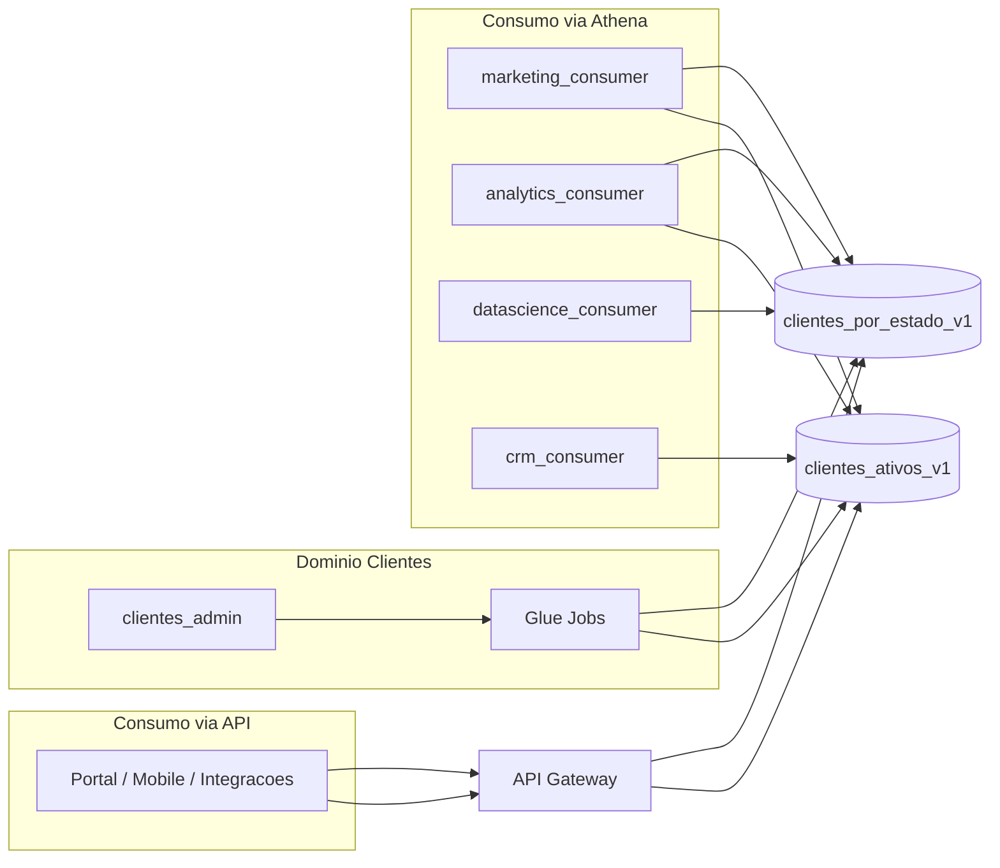

# Simulacao do processo real por ator (Data Mesh)

Este guia descreve como simular, no ambiente **dev**, o fluxo de cada ator da plataforma: produtor, ETL, consumidores federados (Marketing, Analytics, Data Science, CRM), aplicacoes via API e cenarios negativos de governanca.

## Visao geral



## Atores e permissoes

| Ator | Role IAM | Data Products | Forma de consumo |
|------|----------|---------------|------------------|
| Admin Clientes | `clientes-domain-dev-admin` | Todos (+ datasets internos) | Glue, Athena, S3 |
| ETL | `clientes-domain-dev-etl` | Processa e publica | Glue Jobs |
| Marketing | `clientes-domain-dev-marketing-consumer` | `clientes_por_estado_v1`, `clientes_ativos_v1` | Athena ou API |
| Analytics | `clientes-domain-dev-analytics-consumer` | Ambos produtos | Athena |
| Data Science | `clientes-domain-dev-datascience-consumer` | Apenas `clientes_por_estado_v1` | Athena |
| CRM | `clientes-domain-dev-crm-consumer` | Apenas `clientes_ativos_v1` | Athena ou API |
| App corporativa | API Key (sem role IAM) | Endpoints REST | HTTPS + `x-api-key` |
| Consumidor legado | `clientes-domain-dev-consumer` | **Nenhum** produto federado | Deve falhar |

Referencia de governanca: [ADR DM-005](../architecture/decisions/ADR-DM005-federated-governance.md).

---

## Pre-requisitos

### 1. Infraestrutura provisionada

```powershell
cd terraform/environments/dev
terraform apply
```

### 2. Dados publicados (simula rotina do dominio)

```powershell
aws glue start-job-run --job-name clientes-domain-dev-customer-ingestion
aws glue start-crawler --name clientes-domain-dev-customer-crawler

aws glue start-job-run --job-name clientes-domain-dev-orders-ingestion
aws glue start-crawler --name clientes-domain-dev-orders-crawler

aws glue start-job-run --job-name clientes-domain-dev-clientes-por-estado-v1-publish
aws glue start-job-run --job-name clientes-domain-dev-clientes-ativos-v1-publish
```

Aguarde cada job em `SUCCEEDED` antes de simular consumo:

```powershell
aws glue get-job-runs --job-name clientes-domain-dev-clientes-ativos-v1-publish --max-items 1
```

### 3. Usuario com permissao para assumir roles

No `terraform.tfvars`, configure `federated_consumer_trusted_principals` com o ARN do usuario ou role que executara a simulacao. Exemplo atual:

```hcl
federated_consumer_trusted_principals = {
  marketing   = ["arn:aws:iam::303238378103:user/usuario-dados"]
  analytics   = ["arn:aws:iam::303238378103:user/usuario-dados"]
  datascience = ["arn:aws:iam::303238378103:user/usuario-dados"]
  crm         = ["arn:aws:iam::303238378103:user/usuario-dados"]
}
```

---

## Helpers PowerShell

Salve em um terminal ou inclua no inicio de cada sessao de demonstracao:

```powershell
function Use-ActorRole {
    param([string]$RoleArn, [string]$SessionName)
    $creds = aws sts assume-role `
        --role-arn $RoleArn `
        --role-session-name $SessionName `
        --output json | ConvertFrom-Json
    $env:AWS_ACCESS_KEY_ID     = $creds.Credentials.AccessKeyId
    $env:AWS_SECRET_ACCESS_KEY = $creds.Credentials.SecretAccessKey
    $env:AWS_SESSION_TOKEN     = $creds.Credentials.SessionToken
}

function Clear-ActorRole {
    Remove-Item Env:AWS_ACCESS_KEY_ID, Env:AWS_SECRET_ACCESS_KEY, Env:AWS_SESSION_TOKEN -ErrorAction SilentlyContinue
}

function Invoke-AthenaQuery {
    param([string]$Query, [string]$Database, [string]$WorkGroup)
    $e = aws athena start-query-execution `
        --query-string $Query `
        --query-execution-context "Database=$Database" `
        --work-group $WorkGroup `
        --output json | ConvertFrom-Json
    do {
        Start-Sleep -Seconds 2
        $r = aws athena get-query-execution --query-execution-id $e.QueryExecutionId --output json | ConvertFrom-Json
        $st = $r.QueryExecution.Status.State
    } while ($st -in @("QUEUED", "RUNNING"))
    return @{ State = $st; Reason = $r.QueryExecution.Status.StateChangeReason }
}

# Variaveis do ambiente
cd terraform/environments/dev
$db           = terraform output -raw glue_database_name
$wg           = terraform output -raw athena_workgroup_name
$adminArn     = terraform output -raw clientes_admin_role_arn
$marketingArn = terraform output -raw marketing_consumer_role_arn
$analyticsArn = terraform output -raw analytics_consumer_role_arn
$dsArn        = terraform output -raw datascience_consumer_role_arn
$crmArn       = terraform output -raw crm_consumer_role_arn
$legacyArn    = terraform output -raw iam_data_product_consumer_role_arn
```

---

## 1. Admin Clientes (dono do dominio)

**Objetivo de negocio:** operar o dominio, auditar catalogo e validar publicacoes.

```powershell
Use-ActorRole $adminArn "sim-admin"

aws glue get-tables --database-name $db

Invoke-AthenaQuery `
    -Query "SELECT customer_state, total_clientes FROM clientes_por_estado_v1 ORDER BY total_clientes DESC LIMIT 5" `
    -Database $db -WorkGroup $wg

Clear-ActorRole
```

**Resultado esperado:** consultas e listagem de tabelas com sucesso.

---

## 2. ETL (processamento batch)

**Objetivo de negocio:** ingestao diaria e publicacao agendada dos Data Products.

```powershell
# Executar pipeline completo (nao requer assume-role se o usuario tiver permissao Glue)
$jobs = @(
    "clientes-domain-dev-customer-ingestion",
    "clientes-domain-dev-orders-ingestion",
    "clientes-domain-dev-clientes-por-estado-v1-publish",
    "clientes-domain-dev-clientes-ativos-v1-publish"
)
foreach ($job in $jobs) {
    $run = aws glue start-job-run --job-name $job --output json | ConvertFrom-Json
    Write-Host "Job $job runId=$($run.JobRunId)"
}
```

**Resultado esperado:** jobs em `SUCCEEDED`; Parquet atualizado em `data-products/`.

---

## 3. Marketing

**Objetivo de negocio:** campanhas por UF e segmentacao de clientes ativos.

### Via Athena

```powershell
Use-ActorRole $marketingArn "sim-marketing"

Invoke-AthenaQuery `
    -Query "SELECT customer_state, total_clientes FROM clientes_por_estado_v1 ORDER BY total_clientes DESC" `
    -Database $db -WorkGroup $wg

Invoke-AthenaQuery `
    -Query "SELECT customer_id, customer_state, ultima_compra FROM clientes_ativos_v1 WHERE customer_state = 'SP'" `
    -Database $db -WorkGroup $wg

Clear-ActorRole
```

### Via API (aplicacao integrada)

```powershell
$apiKey  = terraform output -raw data_products_api_key
$headers = @{ "x-api-key" = $apiKey }

Invoke-RestMethod (terraform output -raw data_products_api_por_estado_url) -Headers $headers
Invoke-RestMethod "$(terraform output -raw data_products_api_ativos_url)?estado=SP" -Headers $headers
```

**Resultado esperado:** HTTP 200 e JSON com dados; queries Athena `SUCCEEDED`.

---

## 4. Analytics

**Objetivo de negocio:** analise cruzada entre distribuicao geografica e base ativa.

```powershell
Use-ActorRole $analyticsArn "sim-analytics"

Invoke-AthenaQuery -Database $db -WorkGroup $wg -Query @"
SELECT
    p.customer_state,
    p.total_clientes,
    COUNT(a.customer_id) AS clientes_ativos
FROM clientes_por_estado_v1 p
LEFT JOIN clientes_ativos_v1 a ON p.customer_state = a.customer_state
GROUP BY p.customer_state, p.total_clientes
ORDER BY p.total_clientes DESC
"@

Clear-ActorRole
```

**Resultado esperado:** join entre ambos produtos com sucesso.

---

## 5. Data Science

**Objetivo de negocio:** features agregadas por estado para modelos.

```powershell
Use-ActorRole $dsArn "sim-datascience"

# Permitido
$rOk = Invoke-AthenaQuery `
    -Query "SELECT * FROM clientes_por_estado_v1 LIMIT 10" `
    -Database $db -WorkGroup $wg
Write-Host "por-estado: $($rOk.State)"

# Negativo: produto nao autorizado
$rFail = Invoke-AthenaQuery `
    -Query "SELECT * FROM clientes_ativos_v1 LIMIT 1" `
    -Database $db -WorkGroup $wg
Write-Host "ativos (esperado FAILED): $($rFail.State)"

Clear-ActorRole
```

**Resultado esperado:** `clientes_por_estado_v1` OK; `clientes_ativos_v1` **FAILED** (Lake Formation).

---

## 6. CRM

**Objetivo de negocio:** abordagem comercial a clientes com compra recente.

```powershell
Use-ActorRole $crmArn "sim-crm"

# Permitido
$rOk = Invoke-AthenaQuery `
    -Query "SELECT customer_id, customer_state, ultima_compra FROM clientes_ativos_v1 WHERE customer_state = 'RJ'" `
    -Database $db -WorkGroup $wg
Write-Host "ativos: $($rOk.State)"

# Negativo
$rFail = Invoke-AthenaQuery `
    -Query "SELECT * FROM clientes_por_estado_v1 LIMIT 1" `
    -Database $db -WorkGroup $wg
Write-Host "por-estado (esperado FAILED): $($rFail.State)"

Clear-ActorRole
```

**Resultado esperado:** `clientes_ativos_v1` OK; `clientes_por_estado_v1` **FAILED**.

---

## 7. Portal / Mobile / Integracao (API)

**Objetivo de negocio:** consumo corporativo sem SQL, Athena ou acesso ao data lake.

```powershell
$apiKey  = terraform output -raw data_products_api_key
$headers = @{ "x-api-key" = $apiKey }
$porEstado = terraform output -raw data_products_api_por_estado_url
$ativos    = terraform output -raw data_products_api_ativos_url

# Portal: distribuicao por estado
Invoke-RestMethod $porEstado -Headers $headers

# CRM mobile: clientes ativos filtrados
Invoke-RestMethod "$ativos`?estado=SP" -Headers $headers

# Contrato: parametro invalido
try {
    Invoke-WebRequest "$ativos`?estado=XXX" -Headers $headers -UseBasicParsing
} catch {
    Write-Host "HTTP $($_.Exception.Response.StatusCode.value__) (esperado 400)"
}
```

**Resultado esperado:** 200 com JSON; `estado=XXX` retorna **400**.

Contrato OpenAPI: [data-products-api-v1.yaml](../openapi/data-products-api-v1.yaml).

---

## 8. Consumidor legado (teste negativo)

**Objetivo:** provar que a role antiga nao acessa produtos federados.

```powershell
Use-ActorRole $legacyArn "sim-legacy"

$r = Invoke-AthenaQuery `
    -Query "SELECT * FROM clientes_por_estado_v1 LIMIT 1" `
    -Database $db -WorkGroup $wg
Write-Host "legacy (esperado FAILED): $($r.State)"

Clear-ActorRole
```

**Resultado esperado:** query **FAILED** por falta de grant Lake Formation.

---

## Roteiro de demonstracao (30 min)

| Ordem | Ator | Acao | Evidencia |
|-------|------|------|-----------|
| 1 | Admin | `terraform apply` | Stack provisionada |
| 2 | ETL | Jobs de ingestao e publicacao | Jobs `SUCCEEDED` |
| 3 | Marketing | API `/clientes/por-estado` e `/clientes/ativos?estado=SP` | JSON 200 |
| 4 | Analytics | JOIN Athena entre produtos | Query `SUCCEEDED` |
| 5 | Data Science | SELECT por-estado OK; ativos FAIL | Governanca LF |
| 6 | CRM | SELECT ativos OK; por-estado FAIL | Governanca LF |
| 7 | App API | Consumo so com API Key | Sem credencial AWS |
| 8 | Legado | Query negada | Isolamento |

---

## Validacao automatizada

Execute a suite de testes equivalente a cada sprint:

```powershell
# Na raiz do repositorio
powershell -File tests/Run-DM003Tests.ps1 -RunPublish
powershell -File tests/Run-DM004Tests.ps1 -RunPublish
powershell -File tests/Run-DM005Tests.ps1
powershell -File tests/Run-DM006Tests.ps1 -SkipApply
```

Ou a partir de `terraform/environments/dev`:

```powershell
powershell -File run-dm005-tests.ps1
powershell -File run-dm006-tests.ps1 -SkipApply
```

---

## Dicas para apresentacao

1. Abra **quatro contextos** (terminais ou perfis): Admin, Marketing, CRM, Data Science.
2. Comece pelo **Admin/ETL** publicando dados.
3. Mostre **Marketing** consumindo via API (caso de app).
4. Mostre **CRM** e **Data Science** via Athena com allow/deny.
5. Encerre com **consumidor legado** bloqueado e **API** sem acesso direto ao lake.

Isso evidencia os tres pilares do Data Mesh implementados: **dominio produtor**, **governanca federada** e **consumo desacoplado**.
